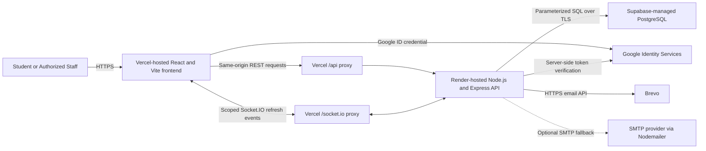

# STI Vio-Log Capstone Paper Sourcebook

> **Purpose.** This file is an evidence-based reference for preparing the STI Vio-Log capstone manuscript, presentation, and defense. It explains what the repository shows about the system, how the parts interact, and where the material may be used in a paper. It is not a finished manuscript and does not replace the school’s required research format.

## 1. Evidence Labels and Writing Rules

The following labels prevent the paper from presenting an assumption as a completed or evaluated result.

| Label | Meaning |
|---|---|
| **Implemented** | The behavior or technology is directly visible in source code, database migrations, or automated tests. |
| **Configured/Deployed** | Repository configuration supports the platform or deployment arrangement. A live-environment check is still needed before claiming that it is currently deployed. |
| **Documented** | An existing project document describes the item, but this sourcebook does not treat the document alone as proof of live operation. |
| **Needs verification** | The researchers must confirm the item through a running system, institutional record, test result, interview, or approved research instrument. |

Repository evidence should support technical descriptions. It cannot, by itself, prove usability, user satisfaction, organizational effectiveness, faster processing, fewer errors, or improved student outcomes. Such conclusions require collected and analyzed research data.

## 2. System Overview

**Implemented.** STI Vio-Log is a web-based student violation, community-service, QR attendance, communication, reporting, and disciplinary-clearance management system. The repository contains separate browser and server applications, a PostgreSQL schema managed through migrations, role-restricted API routes, and interfaces for students and authorized personnel. Evidence: `README.md`, `frontend/src/App.jsx`, `backend/src/server.js`, and `database/migrations/`.

The system addresses the operational difficulty of keeping disciplinary records, service assignments, attendance sessions, communication, and clearance decisions connected and traceable. Instead of treating these as isolated records, the implementation links a violation lifecycle to community-service progress, time-in/time-out sessions, reporting, notifications, audit history, and clearance eligibility.

### 2.1 Intended users and roles

| User or role | Main system responsibilities | Evidence status |
|---|---|---|
| **Student (`STUDENT`)** | Views their profile, QR identity, violations, service progress, DTR, notifications, messages, and clearance information. | **Implemented** — student components, controllers, routes, and tests. |
| **Department Account / Department Head (`DEPARTMENT_HEAD`)** | Handles department-scoped assignments and QR attendance while being restricted from other departments and protected disciplinary functions. | **Implemented** — authorization middleware, department controllers, SQL scoping, and isolation tests. |
| **Discipline Office (`DISCIPLINE_OFFICE`)** | Manages operational disciplinary work such as violations, assignments, attendance review, guardian-contact records, clearance, communication, and reports, subject to permissions. | **Implemented** — routes, controllers, permission definitions, and tests. |
| **Discipline Administrator (`DISCIPLINE_ADMIN`)** | Performs protected administration, account management, monitoring, high-risk actions, and selected institutional operations. | **Implemented** — system administration, account administration, MFA, audit, and security modules. |

Role names and responsibilities should be copied consistently into the paper. The project documentation sometimes uses informal labels such as “DO Admin”; the code-level role constants above are the more precise technical terms. Evidence: `backend/src/security/permissions.js`, `backend/src/middleware/authMiddleware.js`, and `docs/FUNCTIONAL-REQUIREMENTS.md`.

## 3. Verified Technology and Platform Inventory

### 3.1 Frontend technologies

| Technology | Classification | Function in STI Vio-Log | Evidence |
|---|---|---|---|
| React 19 | Frontend library | Builds the role-based, component-oriented browser interface. | **Implemented** — `frontend/package.json`, `frontend/src/main.jsx`, `frontend/src/App.jsx`. |
| Vite 8 | Build tool and development server | Runs local frontend development and produces the production bundle. | **Implemented** — `frontend/package.json`, `frontend/vite.config.js`. |
| JavaScript, JSX, HTML5, and CSS | Web languages | Define application behavior, page structure, components, responsive presentation, and visual styles. | **Implemented** — `frontend/src/` and `frontend/index.html`. |
| Socket.IO Client 4 | Real-time client library | Receives authenticated, audience-scoped refresh events and prompts the interface to retrieve authoritative data. | **Implemented** — `frontend/package.json`, `frontend/src/lib/realtime.js`. |
| `html5-qrcode` | Browser QR-scanning library | Uses a permitted device camera to scan student QR codes in department workflows. | **Implemented** — `frontend/package.json`, `frontend/src/components/DepartmentQrScanner.jsx`. |
| `qrcode` | QR-generation library | Generates a student-facing QR image from the opaque QR payload supplied by the system. | **Implemented** — `frontend/package.json`, `frontend/src/components/StudentQr.jsx`. |

### 3.2 Backend and API technologies

| Technology | Classification | Function in STI Vio-Log | Evidence |
|---|---|---|---|
| Node.js | Server runtime | Executes the backend application, scripts, and automated tests. | **Implemented** — backend npm scripts and CommonJS modules. |
| Express 5 | Web framework | Defines HTTP middleware, REST-style routes, request validation, authorization boundaries, and error handling. | **Implemented** — `backend/package.json`, `backend/src/server.js`, `backend/src/routes/`. |
| REST-style JSON API | Application interface | Connects the React client to authentication, student, violation, service, QR, clearance, report, messaging, and administration functions. | **Implemented** — `backend/src/routes/`, `docs/api/openapi.json`. |
| Socket.IO 4 | Real-time communication library | Sends scoped update events to user, role, or department rooms over WebSocket or fallback transport. | **Implemented** — `backend/src/realtime.js`, `backend/src/services/realtimeEventService.js`. |
| `pg` | PostgreSQL driver | Provides connection pooling, parameterized queries, transactions, and database access. | **Implemented** — `backend/package.json`, `backend/src/config/database.js`. |

### 3.3 Database and data management

| Technology or practice | Function in STI Vio-Log | Evidence status |
|---|---|---|
| PostgreSQL | Stores accounts, students, departments, violations, assignments, attendance sessions, messages, notifications, clearances, certificates, security events, and audit history. | **Implemented** — `database/migrations/`. |
| Versioned SQL migrations | Builds and evolves the schema through ordered, reviewable changes. | **Implemented** — `database/migrations/001_initial_schema.sql` through later migrations and `backend/scripts/migrate.js`. |
| Transactions | Keep related multi-table operations atomic so partial disciplinary or attendance updates can be rolled back. | **Implemented** — service/controller transaction logic and `backend/tests/violation-workflow.pgtest.js`. |
| Constraints and guarded state transitions | Protect uniqueness, relationships, valid states, and workflow integrity at application and database levels. | **Implemented** — migrations, validators, and integration tests. |
| Connection pooling and TLS settings | Bound runtime connections, set timeouts, and support verified encrypted production database connections. | **Implemented; Configured/Deployed** — `backend/src/config/database.js`. |
| Runtime/owner role separation and RLS hardening | Separates migration ownership from application access and prevents unintended Data API access. | **Implemented; Configured/Deployed** — migrations 034–036 and `docs/PRODUCTION-DEPLOYMENT.md`. |
| Supabase-managed PostgreSQL | Intended production database platform; Supabase is used as PostgreSQL rather than as browser-side Auth or direct application Data API access. | **Configured/Deployed; Documented** — `backend/src/config/database.js`, `docs/PRODUCTION-DEPLOYMENT.md`. Live use **Needs verification**. |

### 3.4 Authentication and security technologies

| Technology or control | Purpose | Evidence status |
|---|---|---|
| Secure browser sessions | Stores opaque session tokens in host-only, `HttpOnly`, `SameSite` cookies and validates hashed server-side session records. | **Implemented** — session service, authentication middleware, and security tests. |
| CSRF protection | Requires a matching `X-CSRF-Token` for authenticated state-changing requests. | **Implemented** — `backend/src/middleware/authMiddleware.js`, API contract and middleware tests. |
| bcrypt | Hashes passwords rather than storing plaintext credentials. | **Implemented** — authentication/password services and backend dependency manifest. |
| TOTP multi-factor authentication | Adds time-based one-time-password verification and recovery controls for protected administration. | **Implemented** — `backend/src/services/totpService.js`, MFA migrations and tests. |
| JSON Web Token (`jsonwebtoken`) | Supports bounded, purpose-specific verification or recovery challenges; it is not the primary browser-session storage mechanism. | **Implemented** — backend dependency manifest and authentication/account services. |
| Google Identity Services | Verifies Google ID tokens for the supported student identity and registration flows. It does not give the browser direct database access. | **Implemented; Configured/Deployed** — Google identity services/controllers, frontend Google access component, and environment examples. |
| RBAC and permissions | Restricts routes and actions by authenticated role, fine-grained permission, ownership, and department. | **Implemented** — authentication middleware, `backend/src/security/permissions.js`, route definitions, and tests. |
| Department isolation | Derives department access from the authenticated account and rejects cross-department reads or changes. | **Implemented** — department-aware queries and isolation/integration tests. |
| Helmet and Content Security Policy | Adds security-related HTTP headers and limits browser content sources. | **Implemented; Configured/Deployed** — `backend/src/server.js`, `frontend/vite.config.js`, `frontend/vercel.json`. |
| CORS and trusted-origin checks | Restricts browser and Socket.IO origins and applies explicit cross-origin policy. | **Implemented** — server security configuration and real-time initialization. |
| Rate limiting and authentication throttling | Reduces automated abuse against APIs and authentication paths. | **Implemented** — Express rate limiter and `authThrottleService.js`. |
| HTTPS enforcement | Rejects insecure production transport behind the configured trusted proxy. | **Implemented; Configured/Deployed** — `backend/src/config/security.js`, HTTPS tests. |
| Audit and security-event logging | Records sensitive administrative and workflow actions while excluding credentials and protected content. | **Implemented** — audit middleware/controllers, security services, migrations, and tests. |
| Append-only audit hardening | Prevents ordinary update or deletion of protected audit records. | **Implemented** — `database/migrations/031_administrative_audit_hardening.sql`. |

### 3.5 Communication, document, and export technologies

| Technology or capability | Function | Evidence status |
|---|---|---|
| Nodemailer | Provides SMTP-based email delivery as a fallback or local-development option. | **Implemented; Configured/Deployed** — `backend/package.json`, `backend/src/services/emailService.js`. |
| Brevo HTTPS Email API | Preferred configured production email channel when its server-side settings are present. | **Implemented; Configured/Deployed** — email service, `.env.example`, and authentication guide. Live delivery **Needs verification**. |
| PDFKit | Generates downloadable disciplinary-clearance certificates in PDF format. | **Implemented** — `backend/src/services/clearanceCertificateService.js` and certificate tests. |
| ExcelJS | Supports spreadsheet-format reporting/export functionality. | **Implemented** — backend dependency manifest and report controller usage. |
| CSV export | Produces validated, privacy-limited tabular reports for authorized users. | **Implemented** — report controllers/routes and export tests. |
| In-app notifications and messaging | Delivers role-relevant operational updates and authorized text communication. | **Implemented** — message/notification services, routes, frontend components, and tests. |

### 3.6 Deployment, development, and quality platforms

| Platform or tool | Role in the project | Evidence status |
|---|---|---|
| Vercel | Hosts the Vite frontend and proxies `/api/*` and `/socket.io/*` to the backend so browser requests remain same-origin. | **Configured/Deployed; Documented** — `frontend/vercel.json`, `docs/PRODUCTION-DEPLOYMENT.md`. Live status **Needs verification**. |
| Render | Intended host for the Node.js/Express backend and Socket.IO server. | **Configured/Deployed; Documented** — Vercel rewrite destination and deployment guide. Live status **Needs verification**. |
| Supabase | Intended managed PostgreSQL provider, with the application connecting through PostgreSQL credentials rather than exposing Supabase credentials to the browser. | **Configured/Deployed; Documented** — database configuration and deployment guide. Live status **Needs verification**. |
| Git and GitHub | Provide version control and repository collaboration; GitHub hosts the configured automation workflows. | Git is **implemented in the workspace**; remote hosting/current collaboration practice **needs verification**. Evidence: `.git/`, `.github/`. |
| GitHub Actions | Runs backend/frontend verification, dependency auditing, builds, performance checks, secret scanning, and SBOM generation on configured events. | **Configured/Deployed** — `.github/workflows/security.yml`. Workflow run results **Needs verification** in GitHub. |
| Dependabot | Proposes scheduled npm and GitHub Actions dependency updates. | **Configured/Deployed** — `.github/dependabot.yml`. |
| CodeQL | Performs JavaScript/TypeScript static security analysis in CI. | **Configured/Deployed** — `.github/workflows/security.yml`. |
| Gitleaks | Scans repository history for committed secrets. | **Configured/Deployed** — `.github/workflows/security.yml`. |
| ESLint | Checks frontend JavaScript/React code against configured lint rules. | **Implemented; Configured/Deployed** — frontend package and ESLint configuration. |
| Node test runner | Executes backend and frontend unit, contract, security, and integration-oriented tests. | **Implemented** — package scripts and `backend/tests/`, `frontend/tests/`. |
| npm audit and CycloneDX SBOM | Check dependency vulnerabilities and create software bills of materials in CI. | **Configured/Deployed** — security workflow. Actual audit status **Needs verification** from a current run. |
| Performance-budget script | Builds the frontend and checks defined bundle/performance limits. | **Implemented; Configured/Deployed** — frontend package scripts and `frontend/scripts/check-performance-budget.mjs`. |

## 4. System Architecture and Component Interaction

### 4.1 Configured production architecture

**Configured/Deployed; Documented.** The diagram represents the intended production arrangement found in `frontend/vercel.json` and `docs/PRODUCTION-DEPLOYMENT.md`. Researchers should confirm the active domains, deployment status, and provider dashboards before writing that this architecture is currently operational.

### 4.2 Component-interaction summary

| Source | Destination | Interaction | Protection or design rule |
|---|---|---|---|
| Browser UI | Express API | JSON requests through REST-style endpoints | Secure cookie session, CSRF token on mutations, origin checks, input validation, and role/permission checks. |
| Express API | PostgreSQL | Parameterized queries and transactions | Least-privilege runtime role, pool limits, TLS configuration, constraints, and rollback on failure. |
| Express/Socket.IO | Connected clients | Small refresh events sent to authorized user, role, or department rooms | Events avoid private record contents; clients retrieve current records through REST. |
| Browser and backend | Google Identity Services | Client obtains an identity credential; backend verifies its audience and identity claims | No Google client secret or database credential is exposed to the frontend. |
| Express API | Brevo or SMTP | Sends verification or operational email when configured | Credentials remain server-side; delivery status requires live verification. |
| Express API | PDF/Excel/CSV response | Produces authorized certificates and reports | Report filters are validated and sensitive fields are restricted. |

### 4.3 Request and security flow

1. **Implemented.** A user enters through the React interface and authenticates with a supported local or Google-based flow.
2. **Implemented.** The backend verifies credentials, account state, role requirements, and—where required—MFA or forced-password-change state.
3. **Implemented.** A successful login creates an opaque server-side browser session. The browser receives protected session and CSRF cookies rather than a reusable access token in local storage.
4. **Implemented.** For later requests, authentication middleware hashes and validates the session token, checks expiry/revocation and account state, and loads the authoritative role and department context.
5. **Implemented.** State-changing requests must also pass CSRF and trusted-origin checks. Routes then apply role, permission, ownership, and department rules.
6. **Implemented.** Controllers and services validate input and perform parameterized SQL. Related writes use transactions where partial completion would damage workflow consistency.
7. **Implemented.** Successful operations may create audit/security events and send a minimal Socket.IO refresh notification to the relevant audience.
8. **Implemented.** The client retrieves the updated authoritative state through its REST endpoint. Polling provides recovery if the real-time connection is interrupted.

## 5. Major Functional Workflows

### 5.1 Student registration, identity, and access

**Implemented.** The repository contains student password access and Google identity/registration flows. Google credentials are verified on the server. New or linking requests can enter an administrative review process, while approved records create or connect the local identity with an audit trail. Department Google access has been retired in favor of administrator-provisioned department accounts with forced password change. Evidence: Google and student authentication controllers/services, migrations 005–006 and 019–020, `docs/GOOGLE-AUTH-USER-GUIDE.md`.

**Paper use:** Discuss identity verification, controlled registration, account lifecycle, and the separation between an external identity provider and the application’s own authorization model.

### 5.2 Violation management

**Implemented.** Authorized personnel can record and transition violation cases through controlled actions. Structured history and audit entries preserve who performed lifecycle operations, while invalid/cancelled records are treated differently from completed requirements. Evidence: `backend/src/controllers/violationController.js`, `backend/src/services/violationWorkflowService.js`, migrations 002 and 025, violation tests.

**Paper use:** Present the lifecycle as an example of data integrity, accountability, and rule-based process automation. Do not claim that the system reduces violations unless research data demonstrates that outcome.

### 5.3 Community-service assignment and progress

**Implemented.** The Discipline Office assigns required service separately from the violation record and associates work with a department. Progress is derived from credited attendance sessions and cannot exceed the remaining requirement. Result review and department responsibility are represented in later migrations and services. Evidence: community-service controllers/services, migrations 003–004, 013, 018, and 026.

**Paper use:** Explain how separating the offense record, corrective assignment, and attendance evidence improves data normalization and preserves historical meaning.

### 5.4 QR time-in, time-out, and digital DTR

**Implemented.** A department user scans an opaque student QR value. The server derives the authenticated department and scanner identity, checks the relevant assignment, prevents conflicting active sessions, records server timestamps, and calculates worked and credited time at time-out. DTR views and reports use these sessions. Evidence: QR and community-service attendance controllers, `DepartmentQrScanner.jsx`, `StudentQr.jsx`, and workflow integration tests.

**Paper use:** Describe QR as an identifier transport mechanism, not as the source of authorization. The server—not the scanned content—decides access, department scope, timestamps, and credit.

### 5.5 Non-compliance monitoring

**Implemented.** Authorized views and reports identify unresolved or overdue service-related conditions using validated filters and department scoping. Evidence: report controller/routes, department non-compliance frontend modules, notification service, and report tests.

**Paper use:** Position the module as decision support for authorized staff. Any claim that alerts improve compliance is **needs verification** through actual evaluation data.

### 5.6 Parent or guardian contact records

**Implemented.** Authorized personnel can access necessary guardian information and append contact-attempt records. Sensitive access is included in administrative auditing, and report/export rules limit disclosure. Evidence: parent-contact controller/service/routes, migration 012, frontend panel, and API/service tests.

**Paper use:** Discuss traceability and privacy controls. Avoid reproducing real names, phone numbers, or contact notes in the manuscript or screenshots.

### 5.7 Messaging and notifications

**Implemented.** The system supports authorized text communication and operational notifications. Real-time events signal changes to permitted audiences without treating event payloads as the authoritative record. Evidence: message and notification controllers/services, migrations 014 and 016, Socket.IO modules, and tests.

**Paper use:** Explain the hybrid REST and real-time pattern: REST provides consistency and recoverability, while Socket.IO improves interface responsiveness.

### 5.8 Clearance, good standing, and certificates

**Implemented.** Backend rules evaluate unresolved violations and service requirements to determine eligibility. Authorized personnel manage clearance records; eligible students can view records and download signed, tamper-evident PDF certificates. Evidence: clearance controllers/services, certificate service, migrations 024 and related workflow tests.

**Paper use:** Describe the rule-based eligibility model and separation between calculated eligibility, authorized approval, permanent record, and generated certificate.

### 5.9 Reports and exports

**Implemented.** Authorized report endpoints cover violations, community service, DTR, non-compliance, guardian contact, clearance, and good standing. The implementation validates supported filters/sorting and excludes inappropriate internal or sensitive values from exports. Evidence: report controllers/routes, frontend report modules, API contract, privacy tests, and functional requirements.

**Paper use:** Identify reports as operational outputs and possible sources for approved aggregate analysis. Do not insert production student-level records into the manuscript.

### 5.10 Administration, audit, and monitoring

**Implemented.** Protected administration includes account provisioning/recovery, department and officer responsibility management, security events, sanitized component health, and audited high-risk actions. Fresh confirmation and MFA protect selected operations; audit stores are hardened against ordinary alteration. Evidence: system/account administration modules, high-risk action service, security migrations, and administrative tests.

**Paper use:** Relate these controls to accountability, least privilege, separation of duties, and defense in depth. A live penetration test or formal security certification is **needs verification** and must not be implied by code presence.

## 6. Suggested Use in the Capstone Manuscript

### 6.1 Chapters 1 and 2: introduction and related concepts

Possible material:

- Define the manual or fragmented disciplinary-record problem using verified stakeholder information, not assumptions inferred from code.
- State the system objective: centralize authorized management of violations, service assignments, attendance evidence, communication, reporting, and clearance.
- Define the user groups and system boundaries.
- Discuss relevant concepts such as web-based information systems, QR-assisted attendance, RBAC, audit trails, real-time notification, relational databases, and identity federation.
- Compare related systems using published literature. The repository is a primary source for this implementation, not a substitute for scholarly related-literature sources.

**Needs verification:** the researchers’ approved problem statement, institutional workflow interviews, study locale, respondents, theoretical framework, and literature citations.

### 6.2 Chapter 3: methodology, design, and implementation

Strong repository-supported topics include:

- Three-tier web architecture and the configured Vercel–Render–Supabase deployment arrangement.
- React component-based frontend, Express REST API, Socket.IO refresh channel, and PostgreSQL persistence.
- Database migrations, relationships, transactions, constraints, and audit history.
- Authentication, secure sessions, CSRF protection, MFA, RBAC, department isolation, and security headers.
- Violation-to-service-to-attendance-to-clearance workflow.
- Iterative testing through unit, API contract, security, and PostgreSQL integration tests.
- CI checks for builds, linting, dependency audit, secret scanning, CodeQL, performance budget, and SBOM production.

Suggested academic sentence pattern:

> The proponents implemented a three-tier web application in which a React-based client communicates with an Express application programming interface, while PostgreSQL maintains transactional institutional records. Role, permission, ownership, and department checks are enforced by the server before protected data operations are performed.

Adapt the statement to the institution’s prescribed tense and format. Confirm deployed providers before changing “configured” to “deployed.”

### 6.3 Chapter 4: results, testing, and discussion

The repository can support a description of implemented modules and test coverage. Chapter 4 should separately present actual evaluation evidence, such as:

- Functional test results for each approved requirement.
- Role-access and department-isolation scenarios.
- QR time-in/time-out validation and failure handling.
- Transaction rollback and concurrency behavior.
- Report/certificate output validation.
- Security-control and deployment smoke-test results.
- Usability or acceptance results gathered with an approved instrument.

**Needs verification:** current test-run totals, pass/fail output, response-time measurements, respondent demographics, survey computations, acceptance scores, screenshots from an approved test environment, and any comparison with the previous process. Never invent these values from the existence of test files.

### 6.4 Chapter 5: conclusions and recommendations

Conclusions must answer the study objectives using Chapter 4 evidence. Repository-supported recommendations that may be considered—but are not automatically required—include ongoing dependency updates, backup/restore exercises, accessibility evaluation, performance monitoring, periodic access review, security testing, and future integration with approved school information systems.

Do not label an unimplemented idea as an existing feature. Mark future items clearly as proposed enhancements.

## 7. Suggested Figures and Tables

The following artifacts can make the manuscript easier to understand:

1. **System architecture diagram** — adapt the Mermaid diagram in Section 4 after verifying the live deployment.
2. **Use-case diagram** — show Student, Department Account, Discipline Office, and Discipline Administrator boundaries.
3. **Context or data-flow diagram** — show users, STI Vio-Log, identity/email services, and the database without exposing credentials.
4. **Entity-relationship diagram** — derive it from the applied PostgreSQL migrations, then validate cardinalities against the live schema.
5. **Violation and service activity diagram** — record violation → assign service → QR sessions → review/progress → eligibility → clearance.
6. **Role-permission matrix** — derive permissions from middleware and `permissions.js`, not only from visible navigation links.
7. **Technology table** — reuse the verified inventory in Section 3.
8. **Test matrix** — requirement, scenario, expected result, actual result, evidence, and status.
9. **Deployment diagram** — identify Vercel, Render, Supabase, Google, and Brevo only after live confirmation.
10. **Sanitized interface screenshots** — use test accounts and remove personal, credential, QR, contact, violation, and session data.

## 8. Possible Capstone Defense Questions and Evidence-Based Answers

### Why was PostgreSQL selected?

PostgreSQL supports the relational structure, constraints, transactions, indexes, role separation, and audit-oriented operations required by the system. The implementation uses parameterized queries and transaction boundaries for connected disciplinary workflows. Avoid claiming that it is objectively “the best” database without a defined comparison.

### Why use both REST and Socket.IO?

REST remains the authoritative and recoverable interface for reading and changing records. Socket.IO sends small, scoped refresh signals so connected screens can update promptly; polling can recover after an interrupted real-time connection.

### How is a QR code secured?

The QR value identifies the student record but does not grant permission by itself. The authenticated server session determines the scanner’s role and department, validates the assignment, uses server timestamps, and enforces workflow rules.

### How does the system prevent one department from viewing another department’s records?

Department identity is derived from the authenticated account. Backend queries and authorization rules restrict applicable assignments, attendance, students, and reports to that department, with automated isolation scenarios in the test suite.

### Why are secure cookies used instead of local storage tokens?

The implementation keeps opaque session values in `HttpOnly` cookies so browser JavaScript cannot read them directly. Server-side session records permit expiry and revocation, while CSRF tokens and trusted-origin checks protect state-changing requests.

### Does Google sign-in replace the system’s authorization?

No. Google verifies an external identity credential. STI Vio-Log still controls registration approval, local account state, role, permissions, department association, session issuance, and audit history.

### How is data consistency maintained?

The system uses database constraints, controlled state transitions, parameterized queries, and transactions. Integration tests include rollback and concurrency scenarios for workflows in which a partial write would be unsafe.

### Can the proponents claim that the system is secure?

The paper may describe the implemented security controls and report executed security test results. It should not claim absolute security. A formal audit, penetration test, and operational monitoring evidence must be identified explicitly if performed.

### How was effectiveness evaluated?

**Needs verification.** Answer using the approved research design, actual respondents, instruments, measurements, and analyzed results. Automated software tests demonstrate technical behavior; they do not establish user satisfaction or institutional effectiveness.

## 9. Glossary

| Term | Meaning in this project |
|---|---|
| API | Application Programming Interface used by the frontend to request backend functions and data. |
| CSRF | Cross-Site Request Forgery; a risk mitigated through a request token and trusted-origin checks. |
| DTR | Daily Time Record formed from community-service time-in and time-out sessions. |
| MFA | Multi-Factor Authentication; an additional verification factor beyond the password. |
| QR code | Machine-readable representation of an opaque student identifier used in attendance workflows. |
| RBAC | Role-Based Access Control, supplemented here by permissions, ownership, and department scope. |
| REST | HTTP-based resource and action interface used as the authoritative application channel. |
| RLS | PostgreSQL Row-Level Security used as part of database-access hardening. |
| SBOM | Software Bill of Materials listing software dependencies for security and supply-chain review. |
| Socket.IO | Real-time communication library used for scoped refresh notifications. |
| TOTP | Time-Based One-Time Password used as an MFA mechanism. |

## 10. Verification Checklist Before Copying Material into the Paper

- [ ] Confirm the official capstone title, objectives, scope, and role names with the approved proposal.
- [ ] Confirm the frontend, backend, and database are currently deployed on the providers named in this file.
- [ ] Confirm the production email channel and Google client configuration without recording secret values.
- [ ] Run the current automated test, lint, build, migration-status, and production-readiness commands and preserve dated results.
- [ ] Validate diagrams against the applied production schema and active routes.
- [ ] Use only synthetic or properly anonymized data in figures, tables, demonstrations, and screenshots.
- [ ] Obtain adviser or institutional approval before reporting operational school data.
- [ ] Support usability, effectiveness, performance, and acceptance claims with actual research instruments and results.
- [ ] Cite external scholarly and technical sources using the institution’s required citation style.
- [ ] Describe limitations, failed tests, and unimplemented enhancements honestly.

## 11. Primary Repository Evidence Index

| Topic | Primary evidence locations |
|---|---|
| Project scope and roles | `README.md`, `docs/FUNCTIONAL-REQUIREMENTS.md` |
| Frontend stack and interface | `frontend/package.json`, `frontend/src/`, `frontend/tests/` |
| Backend stack and routes | `backend/package.json`, `backend/src/server.js`, `backend/src/routes/` |
| Database design and evolution | `database/migrations/`, `backend/scripts/migrate.js` |
| Authentication and authorization | `backend/src/middleware/authMiddleware.js`, `backend/src/security/permissions.js`, authentication services/tests |
| Google identity | Google controllers/services, `frontend/src/components/GoogleStudentAccess.jsx`, Google identity documentation |
| Real-time updates | `backend/src/realtime.js`, `backend/src/services/realtimeEventService.js`, `frontend/src/lib/realtime.js` |
| Reports and certificates | report controllers/routes/tests, `backend/src/services/clearanceCertificateService.js` |
| Production architecture | `frontend/vercel.json`, `backend/src/config/database.js`, `docs/PRODUCTION-DEPLOYMENT.md` |
| CI and software security | `.github/workflows/security.yml`, `.github/dependabot.yml` |
| Backup and recovery | `backend/scripts/backup.js`, `docs/DATABASE-BACKUP-RECOVERY.md` |

---

**Research integrity reminder:** Code proves that a mechanism is present; executed tests provide evidence about specified behavior under test conditions; production monitoring describes operational behavior; and research instruments evaluate effects on people and processes. The capstone paper should state which kind of evidence supports each conclusion.
