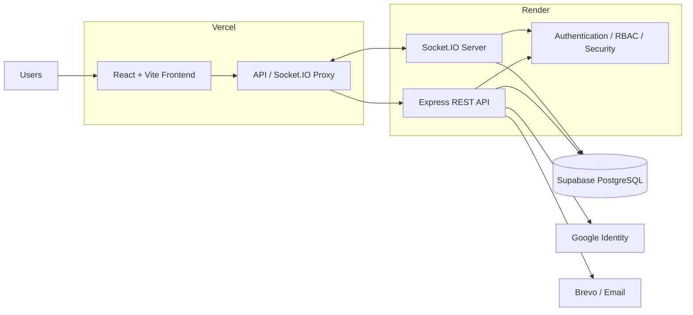
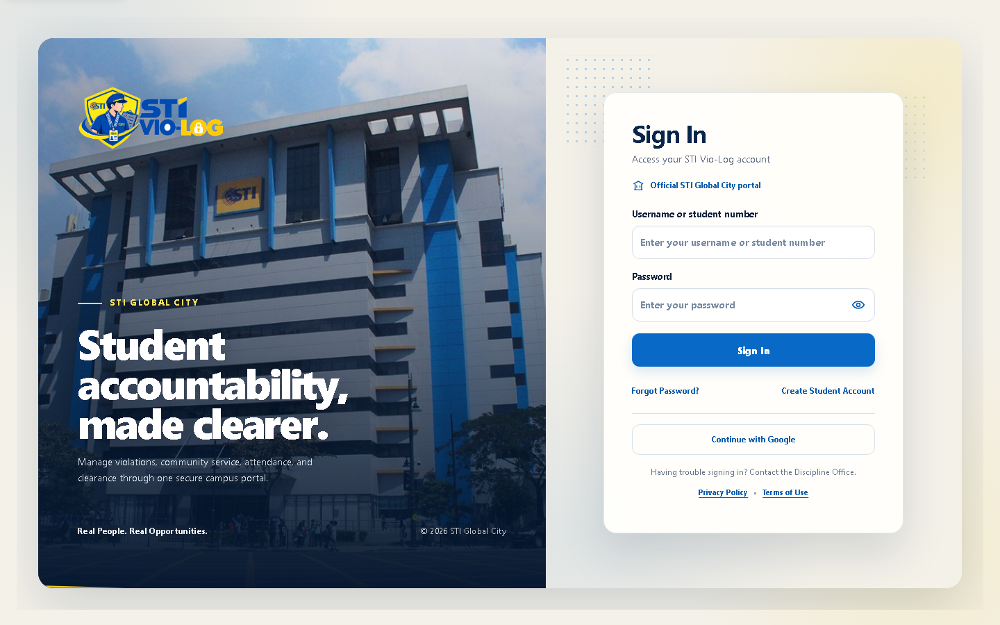
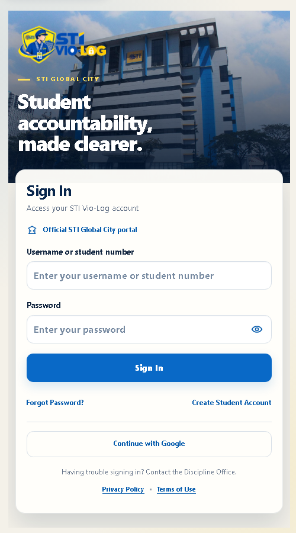

<div align="center">

# STI Vio-Log

### A Web-Based Student Violation Monitoring and Incident Management System for STI Global City

A centralized discipline-management platform for **student violations, Community Service, QR Attendance, Digital Daily Time Records, Guardian Contact, messaging, disciplinary clearance, certificates, reporting, and audit monitoring**.

<br>


</div>

---

## About the Project

**STI Vio-Log** is a web-based student discipline and incident-management system developed for **STI College Global City**.

The platform is designed to help the Discipline Office replace fragmented and manual processes with a centralized digital workflow for managing:

- Student violations
- Community Service requirements
- QR-based Time In and Time Out
- Digital Daily Time Records
- Attendance outcomes
- Department assignments
- Guardian Contact records
- Student communication
- Notifications
- Disciplinary standing
- Clearance processing
- Certificates
- Reports
- Audit logs
- Administrative and security monitoring

The system uses **Role-Based Access Control (RBAC)** so each user can only access the information and operations authorized for their role.

---

## Table of Contents

- [System Workflow](#system-workflow)
- [Key Features](#key-features)
- [User Roles](#user-roles)
- [Technology Stack](#technology-stack)
- [System Architecture](#system-architecture)
- [Interface Preview](#interface-preview)
- [Repository Structure](#repository-structure)
- [Getting Started](#getting-started)
- [Environment Configuration](#environment-configuration)
- [Database Migrations](#database-migrations)
- [Development Commands](#development-commands)
- [Testing](#testing)
- [Authentication and Access Control](#authentication-and-access-control)
- [Real-Time Updates](#real-time-updates)
- [Security](#security)
- [Production Architecture](#production-architecture)
- [Documentation](#documentation)
- [Project Status](#project-status)

---

# System Workflow

A typical disciplinary workflow in STI Vio-Log follows this process:

```text
┌──────────────────────────┐
│    Violation Recorded    │
└────────────┬─────────────┘
             │
             ▼
┌──────────────────────────┐
│   Disciplinary Review    │
└────────────┬─────────────┘
             │
             ▼
      Community Service
          Required?
          /       \
        No         Yes
        │           │
        │           ▼
        │   ┌────────────────────┐
        │   │ Department /       │
        │   │ Officer Assignment │
        │   └─────────┬──────────┘
        │             │
        │             ▼
        │   ┌────────────────────┐
        │   │     QR Time In     │
        │   └─────────┬──────────┘
        │             │
        │             ▼
        │   ┌────────────────────┐
        │   │ Community Service  │
        │   └─────────┬──────────┘
        │             │
        │             ▼
        │   ┌────────────────────┐
        │   │     Time Out       │
        │   └─────────┬──────────┘
        │             │
        │             ▼
        │   ┌────────────────────┐
        │   │ Attendance Outcome │
        │   └─────────┬──────────┘
        │             │
        │             ▼
        │   ┌────────────────────┐
        │   │  Progress Updated  │
        │   └─────────┬──────────┘
        │             │
        └─────────────┼───────────
                      ▼
          ┌──────────────────────┐
          │ Requirement Complete │
          └──────────┬───────────┘
                     │
                     ▼
          ┌──────────────────────┐
          │ Clearance /          │
          │ Certificate          │
          └──────────────────────┘
```

---

# Key Features

## Student Management

- Student profile management
- Student Number-based identity
- Academic information
- Program, year, and section information
- Guardian information
- Student onboarding
- Personal student QR code
- Account-security controls
- Student disciplinary standing
- Community Service progress
- Student-specific dashboard

---

## Violation Management

- Create and manage student violation records
- Incident date and time tracking
- Violation classifications
- Violation lifecycle management
- Complete violation records
- Clear violations with reasons
- Invalid / Cancel workflows
- Reopen workflows
- Violation escalation tracking
- Historical violation preservation
- Audited administrative actions

---

## Community Service Management

- Assign Community Service requirements
- Assign destination departments
- Assign accountable officers
- Required service time
- Completed service time
- Remaining service time
- Active service-session monitoring
- Community Service progress
- Non-compliance monitoring
- Officer responsibility management
- Service-result review

Service duration is calculated using server-authoritative attendance information.

---

## QR Attendance

The QR Attendance module allows authorized Department Accounts to process student Community Service attendance.

Features include:

- Student QR scanning
- Department-scoped attendance
- Time In
- Time Out
- Manual-code fallback where supported
- Active-session validation
- Duplicate-action protection
- Server-authoritative timestamps
- Automatic credited-duration calculation
- Attendance outcome validation
- Live attendance updates
- Current active-session monitoring

---

## Attendance Outcomes

Attendance outcomes provide context when completing a Community Service session.

Examples include:

- Session completed for the scheduled service period
- Student left early
- Service requirement completed
- Sessions requiring additional follow-up

Attendance outcomes are validated as part of the Time Out workflow.

---

## Digital Daily Time Record

The Digital Daily Time Record provides a structured history of Community Service attendance.

It includes:

- Time In
- Time Out
- Credited service duration
- Attendance outcome
- Service-session history
- Student DTR view
- Department DTR view
- Role-scoped reporting

---

## Clearance and Certificates

STI Vio-Log supports disciplinary standing and clearance workflows.

Features include:

- Good Standing evaluation
- Clearance eligibility
- Disciplinary clearance processing
- Backend-controlled eligibility rules
- Certificate generation
- Certificate verification
- Certificate numbering
- E-signature support
- PDF generation
- Certificate delivery workflows

Historical violation records remain preserved even after requirements are completed.

---

## Guardian Contact

Authorized personnel can access Guardian Contact functionality when disciplinary follow-up is required.

Features include:

- Guardian Contact information
- Contact-attempt logging
- Contact notes
- Follow-up records
- Role-scoped access
- Audit visibility where required

Sensitive Guardian Contact information is restricted to authorized users.

---

## Messaging

The communication module provides role-scoped communication between students and authorized staff.

Features include:

- Student-to-staff communication
- Staff-to-student communication
- Conversation states
- Unread indicators
- Close / reopen behavior
- Message timestamps
- Real-time refresh
- Role-based visibility

---

## Notifications

Notifications provide visibility into relevant system events.

Depending on role and permissions, notifications may include:

- Messages
- Community Service activity
- Student Time In
- Student Time Out
- Attendance activity
- Administrative events
- Account-related events

---

## Reports

The reporting module supports disciplinary and Community Service monitoring.

Reports include areas such as:

- Violation reports
- Community Service reports
- Daily Time Record reports
- Non-compliance reports
- Clearance reports
- Good Standing reports
- Guardian Contact reports

Report filters are validated by the backend.

Exports use readable user-facing information rather than exposing unnecessary internal identifiers.

---

## Audit Logging

Important operations are recorded for accountability and traceability.

Audit information may include:

- Actor
- Actor role
- Action
- Target record
- Reason
- Date and time
- Relevant administrative details

Sensitive authentication secrets are not intended to be exposed through normal audit-log views.

---

## Account Administration

Administrative account-management functionality includes:

- Department Account management
- Officer account management
- Student account management
- Account activation
- Account deactivation
- Controlled account recovery
- Temporary-password workflows
- Duplicate-registration review
- Google account-link administration
- High-risk action verification
- Audit logging

Destructive or high-risk operations are protected through additional authorization controls.

---

## System Monitoring

Authorized administrators can access protected technical monitoring.

This may include sanitized information about:

- Application health
- Authentication activity
- Security events
- Failed operations
- Deployment information
- System diagnostics
- Integration status

System Monitoring is designed to avoid unnecessarily exposing application secrets or private operational data.

---

# User Roles

STI Vio-Log currently uses the following application roles:

| System Role | User-Facing Role | Primary Responsibility |
|---|---|---|
| `DISCIPLINE_ADMIN` | Discipline Administrator | Institutional administration and protected System Monitoring |
| `DISCIPLINE_OFFICE` | Discipline Office | Day-to-day disciplinary operations |
| `DEPARTMENT_HEAD` | Department Account / Department Head | Department-scoped Community Service attendance and monitoring |
| `STUDENT` | Student | Self-service access to personal disciplinary and service information |

### Legacy Roles

The database may still contain historical enum values such as:

```text
ADMIN
SYSTEM_ADMIN
```

These are retained for historical database compatibility.

The current application does **not** authorize these legacy values as active application roles.

For detailed permissions, see:

- [RBAC Documentation](docs/api/RBAC.md)
- [Administrator Security Model](docs/administrator-security-model.md)

---

# Technology Stack

## Frontend

| Technology | Purpose |
|---|---|
| React 19 | User interface |
| React DOM 19 | Browser rendering |
| Vite 8 | Development and production build tooling |
| JavaScript | Frontend application logic |
| HTML / CSS | Interface structure and styling |
| Socket.IO Client | Real-time event handling |
| html5-qrcode | QR scanning |
| qrcode | QR generation |
| Vercel Analytics | Deployment analytics |

---

## Backend

| Technology | Purpose |
|---|---|
| Node.js 24.x | Server runtime |
| Express 5 | REST API |
| PostgreSQL `pg` | Database connectivity |
| Socket.IO | Real-time server communication |
| bcrypt | Password hashing |
| Helmet | HTTP security headers |
| express-rate-limit | Rate limiting |
| Google Auth Library | Google authentication |
| Nodemailer | Email support |
| Brevo | Production email delivery |
| PDFKit | PDF document generation |
| ExcelJS | Spreadsheet/report generation |

---

## Database

- PostgreSQL
- Supabase PostgreSQL
- Version-controlled SQL migrations
- Runtime and migration credential separation
- Database security hardening
- Backup and recovery tooling

---

## Infrastructure

| Service | Responsibility |
|---|---|
| Vercel | Frontend hosting and API proxy |
| Render | Node.js / Express backend |
| Supabase | PostgreSQL database |
| GitHub | Source control |
| GitHub Actions | CI and security checks |
| Brevo | Email delivery |

---

# System Architecture



### Architecture Principles

- The backend is the primary authorization boundary.
- Browser code does not receive PostgreSQL credentials.
- Browser code does not receive server signing secrets.
- API and Socket.IO traffic are routed through the application architecture.
- REST APIs remain the authoritative source of application data.
- Real-time events are used to notify clients when relevant data changes.

---

# Interface Preview

## Desktop Login

<p align="center">
  
</p>

## Mobile Login

<p align="center">
  
</p>

The interface is designed to support responsive role-specific experiences for:

- Discipline Administrator
- Discipline Office
- Department Accounts
- Students

---

# Repository Structure

```text
STI-Vio-Log/
│
├── .github/
│   ├── workflows/
│   └── dependabot.yml
│
├── backend/
│   ├── scripts/
│   ├── src/
│   │   ├── config/
│   │   ├── controllers/
│   │   ├── middleware/
│   │   ├── routes/
│   │   ├── security/
│   │   ├── services/
│   │   ├── utils/
│   │   ├── realtime.js
│   │   └── server.js
│   │
│   ├── tests/
│   ├── .env.example
│   └── package.json
│
├── database/
│   └── migrations/
│
├── docs/
│   ├── api/
│   ├── security/
│   └── ...
│
├── frontend/
│   ├── public/
│   ├── scripts/
│   ├── src/
│   │   ├── assets/
│   │   ├── components/
│   │   ├── lib/
│   │   └── styles/
│   │
│   ├── tests/
│   ├── .env.example
│   ├── vercel.mjs
│   ├── vite.config.js
│   └── package.json
│
├── README.md
└── SECURITY.md
```

---

# Getting Started

## Prerequisites

Install the following before starting development:

- **Node.js 24.x**
- **npm 11.x**
- **PostgreSQL**
- **Git**

---

## 1. Clone the Repository

```bash
git clone https://github.com/Eyzen08/STI-Vio-Log.git
cd STI-Vio-Log
```

---

## 2. Backend Setup

Move into the backend:

```bash
cd backend
```

Install dependencies:

```bash
npm ci
```

Create your environment configuration from:

```text
backend/.env.example
```

Create:

```text
backend/.env
```

Configure the appropriate local-development values.

> Never commit real API keys, passwords, signing keys, database credentials, OTP secrets, MFA secrets, backup keys, or production environment configuration.

---

## 3. Database Setup

Check the migration state:

```bash
npm run migrate:status
```

Apply pending migrations:

```bash
npm run migrate
```

---

## 4. Start the Backend

```bash
npm run dev
```

---

## 5. Frontend Setup

Open another terminal:

```bash
cd frontend
```

Install dependencies:

```bash
npm ci
```

Create your frontend environment file using:

```text
frontend/.env.example
```

Create:

```text
frontend/.env
```

Configure browser-safe development values such as the local API origin and Google Client ID when required.

---

## 6. Start the Frontend

```bash
npm run dev
```

Open the URL displayed by Vite.

---

# Environment Configuration

The repository provides example configuration files:

- [Backend `.env.example`](backend/.env.example)
- [Frontend `.env.example`](frontend/.env.example)

---

## Backend Environment Categories

Backend configuration covers areas such as:

- Application environment
- Deployment environment
- Database environment
- PostgreSQL connectivity
- Runtime database URL
- Migration database URL
- Test database URL
- TLS configuration
- Connection pooling
- Browser sessions
- JWT/signing configuration
- CSRF protection
- OTP security
- Authentication throttling
- MFA protection
- Certificate security
- Google Identity
- Brevo configuration
- SMTP configuration
- Backup encryption
- Proxy configuration
- Allowed frontend origins

---

## Frontend Environment Categories

Frontend configuration includes browser-safe values such as:

- API origin
- Google Client ID
- Deployment environment

### Important

Do not place server secrets in frontend variables.

Anything using the `VITE_` prefix may become available to browser code.

---

# Database Migrations

Database migration files are stored in:

```text
database/migrations/
```

Use the built-in migration runner instead of manually applying individual production migrations.

### Check Migration Status

```bash
cd backend
npm run migrate:status
```

### Apply Migrations

```bash
npm run migrate
```

Production deployment uses a controlled migration process.

The production runtime database identity and migration identity are separated where configured.

For additional information:

- [Migration Documentation](docs/api/MIGRATIONS.md)
- [Production Deployment](docs/PRODUCTION-DEPLOYMENT.md)

---

# Development Commands

## Backend Commands

| Command | Description |
|---|---|
| `npm run dev` | Start the API using Nodemon |
| `npm start` | Run production checks and start the API |
| `npm test` | Run backend tests |
| `npm run test:violation-integration` | Run PostgreSQL violation-workflow integration tests |
| `npm run test:migrations` | Run migration integration tests |
| `npm run migrate` | Apply pending migrations |
| `npm run migrate:status` | Show migration status |
| `npm run bootstrap:admin` | Securely bootstrap the Discipline Administrator |
| `npm run backup` | Create a database backup |
| `npm run backup:verify` | Verify a database backup |
| `npm run production:check` | Run production configuration checks |
| `npm run security:database` | Check database security configuration |
| `npm run smoke:production` | Run production smoke checks |

---

## Frontend Commands

| Command | Description |
|---|---|
| `npm run dev` | Start the Vite development server |
| `npm run build` | Build the production frontend |
| `npm run lint` | Run ESLint |
| `npm test` | Run frontend tests |
| `npm run audit:performance` | Build and validate the frontend performance budget |
| `npm run preview` | Preview the production build |

---

# Testing

STI Vio-Log contains automated backend and frontend tests.

Testing covers areas such as:

- Authentication
- Session security
- Role-Based Access Control
- Permission boundaries
- Student accounts
- Staff accounts
- Google authentication
- Violation workflows
- Community Service
- QR Attendance
- Attendance sessions
- Database migrations
- Administrative security
- Account management
- Frontend routes
- Role-specific access
- UI behavior
- Regression behavior

---

## Backend Tests

```bash
cd backend
npm test
```

---

## Violation Integration Tests

```bash
cd backend
npm run test:violation-integration
```

---

## Migration Tests

```bash
cd backend
npm run test:migrations
```

Some PostgreSQL integration tests require a separate disposable database configured through:

```text
TEST_DATABASE_URL
```

Never run destructive test suites against a production database.

---

## Frontend Verification

```bash
cd frontend
npm test
npm run lint
npm run build
```

---

# Authentication and Access Control

STI Vio-Log uses a unified authentication system.

Users do not manually choose an authorization role during login.

The backend determines the authenticated account and applies the corresponding role and permissions.

Current roles:

```text
DISCIPLINE_ADMIN
DISCIPLINE_OFFICE
DEPARTMENT_HEAD
STUDENT
```

---

## Student Authentication

Student functionality includes support for areas such as:

- Student Number-based authentication
- Email-based account processes
- Password authentication
- Email verification
- OTP workflows
- Password reset
- Google Identity integration
- Account linking controls
- Student onboarding
- Password-security requirements

---

## Staff Authentication

Staff accounts are institutionally controlled.

Depending on the account workflow, staff users may receive:

- Administrator-created accounts
- Temporary passwords
- Mandatory password changes
- Role-specific permissions
- Department restrictions

---

## Discipline Administrator Security

The Discipline Administrator receives stronger controls for protected administrative functionality.

Current source includes controls such as:

- TOTP MFA
- Recovery codes
- Step-up verification for protected operations
- High-risk action controls
- Session validation
- Administrative audit logging

---

# Role-Based Access Control

Authorization is enforced on the backend.

Frontend route protection improves the user experience, but it is **not** treated as the primary security boundary.

Examples:

### Students

Students are restricted to their own authorized information.

### Department Accounts

Department Accounts are restricted to department-scoped Community Service functionality.

### Discipline Office

The Discipline Office handles authorized disciplinary workflows.

### Discipline Administrator

The Discipline Administrator handles authorized institutional administration and protected technical monitoring.

See:

[RBAC Documentation](docs/api/RBAC.md)

---

# Real-Time Updates

STI Vio-Log uses **Socket.IO** for real-time refresh behavior.

Real-time functionality is used in areas including:

- Messages
- Notifications
- Community Service
- QR Attendance
- Active attendance monitoring

The system treats REST APIs as the authoritative source of application state.

Socket.IO events primarily notify authorized clients that relevant data has changed.

This design allows the frontend to recover through REST refreshes if real-time connectivity is interrupted.

---

# Security

STI Vio-Log includes defense-in-depth controls in the current source code.

## Application Security

- Role-Based Access Control
- Permission-based authorization
- Backend authorization enforcement
- Account-state validation
- Password-change enforcement
- Student onboarding enforcement
- Department-scope validation

---

## Session Security

- Opaque browser sessions
- Server-side session validation
- Hashed session identifiers
- `HttpOnly` cookies
- `Secure` cookies in production
- `SameSite=Lax`
- Session revocation
- Authentication-state revalidation

---

## Request Security

- CSRF protection
- Origin validation
- Rate limiting
- Input validation
- Parameterized PostgreSQL queries
- Security headers
- Content Security Policy
- Proxy configuration validation

---

## Password and Authentication Security

- bcrypt password hashing
- Password policy enforcement
- OTP protection
- Authentication throttling
- TOTP MFA for protected administrator access
- Recovery-code support
- High-risk action step-up verification

---

## Database Security

The production database security model includes protections such as:

- Restricted runtime database access
- Separate migration credentials
- PostgreSQL least-privilege principles
- Supabase Row Level Security hardening
- Data API restrictions
- TLS verification
- Controlled migration execution

---

## Backup and Recovery

Repository tooling includes support for:

- Database backups
- Backup verification
- Backup encryption configuration
- Recovery documentation

See:

[Database Backup and Recovery](docs/DATABASE-BACKUP-RECOVERY.md)

---

## CI and Repository Security

The repository includes automated security tooling such as:

- Dependabot
- Gitleaks
- CodeQL
- Dependency auditing
- Security workflow checks
- Software Bill of Materials generation

---

## Security Status

The source code contains substantial security hardening; however, source inspection alone does not prove the production environment is secure.

Production readiness also requires validation of:

- Hosting configuration
- Database permissions
- TLS
- Environment variables
- Proxy configuration
- Production secrets
- Provider configuration
- Runtime behavior
- Backup restoration
- Security monitoring

STI Vio-Log should not be considered fully validated for production student data until the documented staging, security, and acceptance checks have been completed.

### Security Documentation

- [Security Policy](SECURITY.md)
- [Security Audit](docs/security/SECURITY-AUDIT.md)
- [Security Remediation Plan](docs/security/SECURITY-REMEDIATION-PLAN.md)
- [Staging and Production Gate](docs/security/STAGING-AND-PRODUCTION-GATE.md)

---

# Production Architecture

The documented target deployment architecture is:

```text
                         Internet
                            │
                            ▼
                 ┌────────────────────┐
                 │       Vercel       │
                 │                    │
                 │   React + Vite     │
                 │     Frontend       │
                 └─────────┬──────────┘
                           │
                  /api/*   │   /socket.io/*
                           │
                           ▼
                 ┌────────────────────┐
                 │       Render       │
                 │                    │
                 │ Node.js + Express  │
                 │     Socket.IO      │
                 └─────────┬──────────┘
                           │
                           ▼
                 ┌────────────────────┐
                 │      Supabase      │
                 │                    │
                 │    PostgreSQL      │
                 └────────────────────┘
```

---

## Frontend — Vercel

The frontend is built with React and Vite.

Vercel also provides the browser-facing proxy configuration for:

```text
/api/*
/socket.io/*
```

---

## Backend — Render

The backend runs:

```text
Node.js
Express
Socket.IO
```

Production startup performs configuration checks before starting the application.

Pending migrations are not intended to be silently applied by normal application startup.

---

## Database — Supabase

Supabase is used as the production PostgreSQL provider.

The browser does not connect directly to operational database tables using database passwords.

Server-side database credentials remain within the backend environment.

---

# Deployment Verification

Production deployment should verify areas such as:

- Application health
- Environment validation
- Database migration state
- Session cookies
- CSRF behavior
- Origin restrictions
- Authentication
- MFA
- RBAC
- Department isolation
- Content Security Policy
- Database security
- Supabase RLS
- API restrictions
- Production smoke tests
- Backup and restoration

See:

[Production Deployment Guide](docs/PRODUCTION-DEPLOYMENT.md)

---

# Documentation

The repository contains additional technical and project documentation.

| Documentation | Purpose |
|---|---|
| [Functional Requirements](docs/FUNCTIONAL-REQUIREMENTS.md) | Functional system requirements |
| [Roadmap](docs/ROADMAP.md) | Development roadmap |
| [Authentication User Guide](docs/AUTHENTICATION-USER-GUIDE.md) | Authentication guidance |
| [Google Authentication Guide](docs/GOOGLE-AUTH-USER-GUIDE.md) | Google authentication workflow |
| [Google Identity Design](docs/GOOGLE-IDENTITY-DESIGN.md) | Student Google Identity architecture |
| [Department Google Identity Design](docs/DEPARTMENT-GOOGLE-IDENTITY-DESIGN.md) | Department Google Identity architecture |
| [Account Administration Design](docs/ACCOUNT-ADMINISTRATION-DESIGN.md) | Account-management architecture |
| [API Contracts](docs/api/CONTRACTS.md) | Backend API contracts |
| [OpenAPI Specification](docs/api/openapi.json) | Machine-readable API documentation |
| [RBAC](docs/api/RBAC.md) | Role and authorization model |
| [Migrations](docs/api/MIGRATIONS.md) | Migration process |
| [Administrator Security Model](docs/administrator-security-model.md) | Administrator security architecture |
| [Administrator Bootstrap](docs/administrator-bootstrap.md) | Secure administrator provisioning |
| [Database Backup and Recovery](docs/DATABASE-BACKUP-RECOVERY.md) | Backup and recovery procedures |
| [Production Deployment](docs/PRODUCTION-DEPLOYMENT.md) | Vercel, Render, and Supabase deployment |
| [Final Acceptance Checklist](docs/FINAL-ACCEPTANCE-CHECKLIST.md) | Pre-handover validation |
| [Security Audit](docs/security/SECURITY-AUDIT.md) | Security assessment |
| [Security Remediation Plan](docs/security/SECURITY-REMEDIATION-PLAN.md) | Security-hardening plan |
| [Staging and Production Gate](docs/security/STAGING-AND-PRODUCTION-GATE.md) | Deployment security gate |

---

# Project Status

> **Current Status: Active Development and Pre-Handover Validation**

Core workflows currently implemented include:

- Student Management
- Student onboarding
- Authentication
- Google Identity integration
- Violation Management
- Violation escalation
- Community Service
- Department assignment
- Officer assignment
- QR Attendance
- Time In
- Time Out
- Attendance outcomes
- Digital Daily Time Record
- Non-compliance monitoring
- Guardian Contact
- Messaging
- Notifications
- Real-time updates
- Reports
- Audit logging
- Good Standing
- Clearance
- Certificates
- E-signature support
- Account administration
- Duplicate-account review
- Administrative monitoring
- Security controls
- Database migrations
- Backup tooling
- Production-deployment tooling

Development continues to focus on production validation, security verification, deployment checks, user acceptance, and final handover readiness.

---

# Project Information

| | |
|---|---|
| **Project Name** | STI Vio-Log |
| **System Type** | Web-Based Student Discipline and Incident Management System |
| **Institution** | STI College Global City |
| **Frontend** | React + Vite |
| **Backend** | Node.js + Express |
| **Database** | PostgreSQL / Supabase |
| **Real-Time Communication** | Socket.IO |
| **Frontend Hosting** | Vercel |
| **Backend Hosting** | Render |
| **Project Status** | Active Development / Pre-Handover Validation |

---

<div align="center">

## STI Vio-Log

**A Web-Based Student Violation Monitoring and Incident Management System for STI Global City**

Built to improve the visibility, consistency, accountability, and efficiency of student disciplinary and Community Service workflows.

</div>