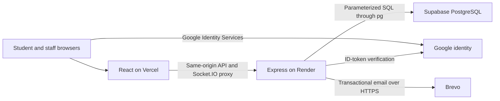

# STI Vio-Log

**A Web-Based Student Violation Monitoring and Incident Management System for STI Global City**

STI Vio-Log connects disciplinary cases, community-service assignments, QR attendance, service credit, guardian-contact logs, messaging, reports and clearance. It provides views for students, Department Accounts, Discipline Office staff and Discipline Administrators.

The repository title is preserved. An approved proposal, formal manuscript and institutional template were not found; institutional approval of the title and requirements remains unverified.

## Evidence and current status

Documentation reviewed **October 10, 2026, Asia/Manila**, against commit `3601e16031c36d08308176d9c7807d02198ac7b8`. The [audit report](docs/AUDIT-REPORT.md) records coverage, provider observations, findings and outstanding work. Source implementation, production workflow verification and client acceptance are separate evidence.

Local checks passed 334 backend and 438 frontend tests, frontend lint/build and the asset budget. All ten PostgreSQL test files ran against a newly initialized disposable local cluster: **48/49 tests passed**, with a stale migration-list expectation failing. Production read-only health, unauthenticated boundaries and CORS smoke checks passed. Camera, authenticated browser workflows, accessibility evaluation, load testing, email delivery and restore recovery remain unverified. See [testing](docs/TESTING.md).

## Architecture


```mermaid
flowchart LR
    Browser[Student and staff browsers] --> Frontend[React on Vercel]
    Frontend -->|Same-origin API and Socket.IO proxy| API[Express on Render]
    API -->|Parameterized SQL through pg| Database[Supabase PostgreSQL]
    Browser -->|Google Identity Services| Google[Google identity]
    API -->|ID-token verification| Google
    API -->|Transactional email over HTTPS| Brevo[Brevo]
```

The frontend uses custom History API routing, React hooks, native `fetch` and custom CSS. Express authenticates the opaque cookie session, checks current permissions and ownership, validates inputs, then calls controllers/services and PostgreSQL. Authenticated Socket.IO events prompt REST refreshes; production uses HTTP polling through Vercel. Supabase provides PostgreSQL; this project does not use its browser Auth, Storage or Realtime SDKs. Brevo integration exists and active sender metadata was observed, but delivery was not tested. The [existing deployment guide](docs/PRODUCTION-DEPLOYMENT.md) separates declared configuration from provider observations.

## Users and modules

| Role | Responsibilities and boundaries |
|---|---|
| `STUDENT` | Own profile, QR, violations, service/DTR, messages, notifications and clearance/certificates. No client-selected ownership. |
| `DEPARTMENT_HEAD` — Department Account | Department-scoped service records, QR Time In/Out and operational DTR. No guardian contacts, messages, clearance approval, global directory or administrative Excel exports. |
| `DISCIPLINE_OFFICE` | Student provisioning/corrections, violations, assignments, attendance/corrections, guardian-contact logs, messaging, clearance/signatures/certificates and reports. |
| `DISCIPLINE_ADMIN` | Staff capabilities plus staff/departments/officer administration, historical registration and duplicate review, audit/system monitoring, protected lock/recovery. TOTP MFA required. |

`ADMIN` and `SYSTEM_ADMIN` are historical database enum labels, not active application roles. [RBAC](docs/api/RBAC.md) lists current permissions.

New students receive staff-issued credentials and complete password change → staff-recorded personal Gmail OTP → matching Google binding → academic/contact/guardian profile. Public password/Google registration and public Google linking are retired. College years 1–4 and SHS ABM/STEM Grades 11–12 are supported for new submissions; historical academic values are preserved. See [authentication](docs/AUTHENTICATION-USER-GUIDE.md) and [academic model](docs/STUDENT-ACADEMIC-MODEL.md).

Attendance uses server timestamps, supervisor authorization and one active session per student. Time-out credits eligible time immediately, capped by the remaining requirement, an eight-hour Manila-day allowance and the session cutoff. Normal credit uses whole minutes; an exact fractional final remainder can finish a six-decimal hour balance. Midnight stops credit; staff still close the session. Corrections preserve attendance and append a separate reasoned adjustment. See [attendance](docs/community-service-attendance.md) and [corrections](docs/admin-violation-editing.md).

Guardian contact is manual; logging a call/SMS attempt does not send an SMS. Certificates contain electronic signature images and a stored PDF snapshot, with no PKI PDF signing. Public verification reports recorded issued/revoked status and limited identity fields. See [API contracts](docs/api/CONTRACTS.md) and [feature traceability](docs/FEATURE_TRACEABILITY.md).

## Technology

JavaScript/JSX, SQL, HTML, CSS and PowerShell; Node **24.x**, npm **11.x**; React **19.2.8**, Vite **8.2.1**, Express **5.2.1**, `pg` **8.23.0**, Socket.IO **4.8.1**, bcrypt **6.0.0**, QR generation/scanning, PDFKit and ExcelJS. Local Node was **24.18.1**; the connected database reported PostgreSQL **17.6**. Exact deployed Node/npm/package versions were not inspected. `@vercel/analytics` is installed but is not loaded by the entry point. [Technology inventory](docs/TECH_STACK.md) separates manifest ranges, lockfile resolutions, installed and provider versions.

## Local setup

Use Node 24/npm 11, PostgreSQL and two terminals. On Windows, `npm.cmd` avoids the PowerShell `npm.ps1` execution-policy issue.

```powershell
# Repository root: install each application's locked dependencies
npm.cmd ci --prefix backend
npm.cmd ci --prefix frontend
Copy-Item backend/.env.example backend/.env
Copy-Item frontend/.env.example frontend/.env
```

Edit the copies privately. Use a **local development database**, `NODE_ENV=development`, `DEPLOYMENT_ENV=local`, `DATABASE_ENVIRONMENT=local`, a local `DATABASE_URL` or `DB_*` settings, and `DB_SSL=disable` only locally. Replace key placeholders with independent random values. Configure a Google Web Client ID and controlled email provider for onboarding/recovery. Examples are templates, not functioning production credentials.

```powershell
# Terminal 1, from backend — modifies the selected local database
npm.cmd run migrate
npm.cmd run dev
```

Bootstrap an individual administrator only on that development database using the [bootstrap guide](docs/administrator-bootstrap.md); bootstrap is disabled unless explicitly enabled. Seed scripts are development utilities and must never target shared records.

```powershell
# Terminal 2, from frontend
npm.cmd run dev
```

Vite normally serves `http://localhost:5173`; the API defaults to port 5000. Set `VITE_API_URL=http://localhost:5000` and an exact local frontend origin in `FRONTEND_URL`. Open `/login`; no role selector is used.

## Configuration and commands

| Configuration | Purpose |
|---|---|
| `DATABASE_URL`, `DB_*`, `DB_SSL`, `DB_SSL_CA`, pool/timeouts | Backend database connection and verified production TLS. |
| `MIGRATION_DATABASE_URL` | Owner connection for controlled migrations; exclude from runtime service. |
| `TEST_DATABASE_URL` | Explicit disposable test database, distinct from application/migration credentials. |
| Session/CSRF/OTP/throttle/MFA/certificate keys | Independent backend secrets; placeholder-only `backend/.env.example`. |
| `GOOGLE_CLIENT_ID`, `VITE_GOOGLE_CLIENT_ID` | Matching public Google Web Client ID. |
| `BREVO_API_KEY`, `BREVO_SENDER_EMAIL`, `BREVO_SENDER_NAME` | Backend email; SMTP is alternative configuration, not automatic failover. |
| `FRONTEND_URL`, `TRUST_PROXY_HOPS` | Exact CORS origins and validated proxy trust. |
| `API_PROXY_ORIGIN`, `PRODUCTION_API_ORIGIN` | Server-side Vercel proxy and preview isolation. |
| `BACKUP_DIR`, `BACKUP_ENCRYPTION_KEY` | Private encrypted-backup location/key. |

From each application's directory:

| Directory | Commands |
|---|---|
| backend | `npm.cmd test`, `npm.cmd run dev`, `npm.cmd start` |
| frontend | `npm.cmd test`, `npm.cmd run lint`, `npm.cmd run build`, `npm.cmd run audit:performance`, `npm.cmd run preview` |

`npm start` runs production readiness checks and does not apply migrations. Database suites, migrations, security/backup commands and production smoke checks have distinct prerequisites and side effects; follow [testing](docs/TESTING.md), [migrations](docs/api/MIGRATIONS.md) and [backup/recovery](docs/DATABASE-BACKUP-RECOVERY.md).

## Security and handover

Source controls include opaque hashed sessions, cookie/CSRF protection, current-state authorization, department/ownership checks, administrator TOTP, bounded OTPs, parameterized SQL, append-only audit/correction records, RLS/grants and password-confirmed lock/recovery. Passing tests do not establish security certification. Read [security policy](SECURITY.md), the [historical security audit](docs/security/SECURITY-AUDIT.md) and [current findings](docs/AUDIT-REPORT.md).

Privacy and Terms pages are published; mandatory acknowledgment is **disabled** pending institutional review. Analytics loading is disabled. Retention, certificate disclosures, backups/PITR and minors procedures need authorized institutional decisions. [Legal review](docs/privacy-terms-review.md) remains a draft.

Use the [acceptance checklist](docs/FINAL-ACCEPTANCE-CHECKLIST.md) with controlled identities before handover. The [paper sourcebook](EJ%20pogi%20ideas%20para%20sa%20Papers%20haha.md) preserves research ideas and supplies manuscript revisions. [Functional requirements](docs/FUNCTIONAL-REQUIREMENTS.md) are repository requirements with external approval unverified; [the roadmap](docs/ROADMAP.md) retains historical proposals rather than serving as the current implementation contract.
