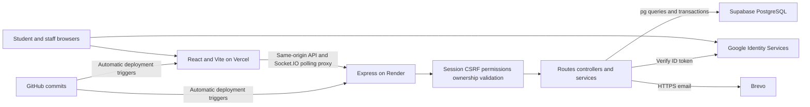

# Vercel, Render and Supabase production deployment

## Observed deployment inventory — October 10, 2026

Source baseline: `3601e16031c36d08308176d9c7807d02198ac7b8`. Read-only provider inspections matched repository/project identity before use. No deployments, settings, environment values, shared migrations or messages were changed. Instructions below are requirements/recommendations, not proof that all live settings match them.

| Platform/category | Responsibility/component | Source/configuration | Observed status | Verification needed / limitation |
|---|---|---|---|---|
| Vercel/frontend | Vite frontend and same-origin API/polling proxy | `frontend/vercel.mjs`, `vite.config.js`; proxy origins, Google public client | Matched `sti-vio-log`, root `frontend`, Vite, `dist`, Node setting 24.x, build `npm run build`, **install `npm install`**. Latest production READY deployment matches audited SHA. Canonical frontend/proxy smoke passed. | Exact runtime, previews and authenticated browser flows unverified. Prefer locked `npm ci` in a separately approved provider change. |
| Render/API | Long-lived Express/Socket.IO | `backend/package.json`, `src/server.js`; origin, database/email/security variables | Matched repository/main, root `backend`, Node **Free** service, Oregon, one instance, automatic commit deployments, previews off. Build `npm ci --omit=dev && npm audit --omit=dev --audit-level=moderate`; start `npm start`. Latest **Live** deployment matches audited SHA. Health/CORS smoke passed. | Release-command and health-check configuration require owner review; detailed control-plane observations are retained privately. No release command was executed. Runtime environment-name inventory/login/TLS and exact runtime unavailable. |
| Supabase/database | PostgreSQL for API, no browser Auth/Storage SDK | Migrations, `src/config/database.js`; runtime/owner URL and TLS names | Matched ACTIVE_HEALTHY project, Tokyo; PostgreSQL **17.6**. All **50 migration filenames** recorded, 49 public tables all RLS-enabled, no anon/authenticated CRUD/public app-function grants in inspected metadata. Nonprivileged app login/runtime group exist. | Actual Render login/pooler/TLS, Data API settings, backups/PITR/retention/restore unverified. Owners can bypass non-FORCE RLS. |
| Brevo/email | Backend HTTPS OTP/reset/credentials/certificates | `emailService.js`; `BREVO_API_KEY`, `BREVO_SENDER_EMAIL`, name/timeouts | One connection errored; another existing connection returned two active project-named senders. Addresses withheld. | Active sender metadata does not prove Render configuration or delivery. Controlled tests needed; no mail sent. |
| Google/identity | Student ID-token verification/binding | GIS helper, `googleIdentityVerifier.js`; matching public client IDs | Source integration and Vercel client variable name present. | Google Cloud origins and live OAuth unavailable. No client secret needed for this flow. |
| GitHub/repository and CI | Source, Actions, Dependabot | `.github/workflows/security.yml`, `.github/dependabot.yml` | Configuration inspected; connected commit lookup returned no PR-triggered runs in its limited scope. | This does not establish absent CI. Full Actions lookup could not execute because automatic approval review hit a usage limit. Job outcomes/branch protection unavailable. |
| Vercel Analytics/analytics | Optional frontend dependency | Manifest; no entry-point loading | **Inactive** in current source. | Logged-in network absence and institutional activation approval unverified. |

Vercel and Render deployment snapshots around **13:16 Asia/Manila, October 10** match the audited commit. Migration 050 metadata records approximately **11:09 Asia/Manila**. These are snapshots, not availability history or workflow certification.

Provider environment names/presence were inspected without retrieving values. The public source configuration inventory is in TECH_STACK.md; the detailed live inventory is retained privately. The owner must verify necessity, least privilege and Production/Preview isolation. Vite normally exposes VITE-prefixed values; environment-name presence alone does not establish browser exposure.

## Current architecture and request flow



Google/mail source branches exist; live completion was not tested. Email is synchronous with timeout/errors and no durable queue. Socket.IO sends scoped refresh signals after committed writes; REST remains authoritative. Database pooling belongs to Render, not a currently deployed Vercel backend function.

## Operational limits and recommendations

**Current limits:** one Free API instance; incomplete provider environment/runtime evidence; no verified backup/PITR/restore; no full authenticated/browser/load/security evaluation; backup-storage review pending; retired registration tables retained; legal acknowledgment disabled. Health alone does not establish handover readiness.

**Recommendations, not changes made:** review the release command and health-check configuration, verify runtime least privilege/TLS/proxy trust and preview isolation, use reproducible installs, approve backup/restore monitoring/retention, and test controlled Google/email/camera/revocation journeys. Keep owner credentials out of frontend/runtime services and migrations out of runtime startup. [The audit](AUDIT-REPORT.md) assigns priorities and next actions.

## Required architecture

Deploy the Vite frontend on Vercel and the Express API on Render. Vercel proxies `/api/*` and `/socket.io/*` to Render, so the browser sees a single origin and host-only `SameSite=Lax` cookies remain first-party. Use Supabase only as PostgreSQL: browser code must never receive the database password, service-role key, or a direct STI Vio-Log table grant.

The browser must use the Vercel origin for API requests. `frontend/vercel.mjs` builds the same-origin proxy from the environment-scoped `API_PROXY_ORIGIN`; it fails non-production builds that match `PRODUCTION_API_ORIGIN`. Do not configure browser requests to bypass that proxy. Custom same-site domains remain recommended if they are added later.

Production frontend builds, including deployed previews, use Socket.IO HTTP long-polling through `/socket.io/*` with WebSocket upgrades disabled. This still delivers live events and preserves first-party session cookies through the existing proxy. Local development connects with polling first and may upgrade to WebSocket. The proxy explicitly rewrites `/socket.io/` as well as its subpaths so the trailing-slash handshake cannot fall through to the SPA. Deploy both the frontend routing fix and the backend request policy; no database migration is required.

The backend accepts an allowlisted `Origin`, or a polling GET with no `Origin` only when `Sec-Fetch-Site` is `same-origin` and the `Referer` origin is allowlisted. Preserve these browser headers through the proxy. An explicitly unapproved `Origin` always fails, and every Socket.IO connection still requires a valid browser session.

## Vercel frontend

Set these encrypted environment variables for Production (and separately for Preview if previews are allowed):

- `VITE_API_URL` is used only during local development. Production builds use the same-origin Vercel proxy.
- `VITE_GOOGLE_CLIENT_ID` for a Google web client authorized only for the exact frontend origin.

Build from `frontend` with `npm ci && npm run build`. The build injects an exact CSP for the configured API and WebSocket origins. `frontend/vercel.mjs` also supplies HSTS, anti-framing, nosniff, referrer, permissions, opener, and resource-policy headers. After changing an environment variable, create a new deployment; existing deployments do not inherit the change.

Do not expose server secrets with a `VITE_` prefix. Disable public Vercel previews or give Preview a separate non-production API/database and explicit origin.

## Supabase database

Use two connection strings:

- `DATABASE_URL`: provider-approved runtime pooler/direct URL with the dedicated app login. Transaction pooling commonly uses port 6543; confirm provider settings. The current Render process defaults to ten pooled connections; the conditional one-connection Vercel behavior is not the observed backend deployment.
- `MIGRATION_DATABASE_URL`: direct connection or session pooler URL (port 5432) for migrations, held only by the deployment/migration job.

Require verified TLS and never set `DB_SSL=no-verify` in production. Enable Supabase SSL enforcement. Migration 034 revokes `anon` and `authenticated` access to application tables and enables RLS so the Supabase Data API cannot become an accidental bypass. If the Data API is not used by any other schema, disable it or expose a separate empty schema in Supabase API settings.

Migration 034 creates the non-login `sti_vio_log_runtime` permission group, grants it application DML through a dedicated RLS policy, and permits only SELECT/INSERT on audit stores. In the Supabase SQL editor, create a unique password-manager-generated login and grant the group to it:

```sql
create role sti_vio_log_app with login password '<PASSWORD-MANAGER-GENERATED SECRET>';
grant sti_vio_log_runtime to sti_vio_log_app;
```

Use that login in `DATABASE_URL` and test the provider-specific pooler username format. The production readiness check rejects an owner, superuser, database/role creator, RLS-bypass role, or login without this membership. Keep the owner/migration credential out of the runtime environment. Rotate any database credential that was ever copied into source, chat, logs, or a frontend setting.

## Backend secrets

Set all of these as encrypted production-only variables:

- `NODE_ENV=production`
- `FRONTEND_URL=https://app.school.edu` (comma-separated only when every origin is intended)
- `DATABASE_URL` and deployment-only `MIGRATION_DATABASE_URL`
- `GOOGLE_CLIENT_ID`
- `SESSION_HASH_KEY`, `CSRF_SIGNING_KEY`, `OTP_HASH_KEY`, `AUTH_THROTTLE_KEY`, `MFA_RECOVERY_KEY`, and `CERTIFICATE_SIGNING_KEY`: independent random values of at least 32 bytes
- `MFA_ENCRYPTION_KEY`: exactly 32 random bytes encoded as Base64
- `TRUST_PROXY_HOPS`: the validated proxy-hop count for the API host (normally `1`, but confirm with the host)

Never reuse keys between purposes. Startup rejects missing, short, placeholder, or insecure settings. Keep legacy `JWT_SECRET` independent while required by readiness/development compatibility. Normal browser sessions and current reset authorizations use hashed opaque values; retained legacy bearer issuance is disabled in production. Configure `DEPLOYMENT_ENV` and `DATABASE_ENVIRONMENT` consistently with the readiness check and the selected email provider.

## Release procedure

Run migrations once with the owner credential before routing traffic, then start the API with only the runtime credential. `npm start` deliberately does not apply migrations; it fails closed when a migration is pending. Run `npm run migrate` as a separate controlled release step with `MIGRATION_DATABASE_URL`, then remove that owner credential from the running service.

If an automatic Render deployment fails because a migration is pending, apply the migration first and then explicitly redeploy the latest commit. A failed deployment does not automatically retry after the database becomes current, and an empty Git commit may not create a new Render deployment.

For the College / Senior High School ABM/STEM release, confirm migrations `042_student_academic_level.sql` and `043_student_academic_strands.sql` exist in the checkout and are applied before redeploying the backend. On Windows, run the masked migration helper from the repository root:

```powershell
powershell.exe -NoProfile -ExecutionPolicy Bypass -File .\backend\scripts\migrate-production.ps1
```

This uses `npm.cmd` to avoid PowerShell blocking `npm.ps1`, checks migration status before and after applying pending migrations, and clears the prompted credential afterward (restoring any prior process value). The execution-policy override applies only to this PowerShell process. Use the owner direct/session-pooler URL at the masked prompt; do not put it in the command or chat. Stop on any error. Confirm both migration 042 and `043_student_academic_strands.sql` are marked `applied`, then manually deploy the latest backend commit on Render and wait for Live. Verify the Vercel production `API_PROXY_ORIGIN` points to that backend HTTPS origin, redeploy the frontend if needed, and test College, ABM Grade 11, and STEM Grade 12 onboarding with test accounts. A healthy `/api/health` response alone does not verify that this migration or onboarding release is deployed.

After deployment verify:

1. `GET /api/health` returns 200 without disclosing configuration.
2. Login sets host-only `HttpOnly; Secure; SameSite=Lax` `sti_session`, and no token appears in local storage or JSON.
3. Every authenticated mutation without a matching `X-CSRF-Token` fails.
4. An unapproved Origin fails for HTTP and Socket.IO.
5. DISCIPLINE_ADMIN must enroll/verify TOTP before API access; recovery codes work once.
6. Student, department, administrator, forced-password, ownership, and deactivated-account boundaries hold.
7. CSP has no violations during Google login, MFA, QR camera, exports, certificates, and realtime use.
8. Supabase Table Editor confirms RLS enabled and `anon`/`authenticated` have no table privileges.
9. Run `npm run smoke:production` with `PRODUCTION_FRONTEND_URL` and `PRODUCTION_API_URL` set locally.

For the realtime transport release, sign in with test accounts and filter the browser Network panel for `/socket.io/`. Confirm polling requests succeed and no WebSocket requests are attempted; a pending long-polling GET while waiting for events is normal. In two authenticated test sessions, confirm messages and attendance changes update automatically, a temporary offline interruption reconnects after network restoration, and logout stops the connection. If polling fails, inspect its response and Render logs for proxy, Origin, or session errors before declaring the release verified. Clear the Console before checking so historical WebSocket failures are excluded.

Verify a fresh MFA code completes login and an invalid code shows the expected authentication error. Invalid codes and expired MFA challenges should continue returning HTTP 401. Vercel Analytics loading is disabled; production network inspection must show no analytics script or collection requests.

## Privacy Notice and Terms technical release

Apply migration `050_terms_acknowledgments.sql` through the controlled migration process before deploying this backend release. The shared policy manifest keeps `enforcementEnabled: false`; the public pages contain factual corrections, while expanded legal wording stays in `docs/privacy-terms-review.md`. Confirm password, Google, MFA and restored sessions still reach the portal without acknowledgment. Check policy links from login and account settings, preserved return locations, visible versions and revision dates, and the absence of analytics requests.

After authorized administration and DPO approval, add immutable approved policy snapshots, update the shared published document imports, and enable enforcement in a reviewed release. Increment `acknowledgmentVersion` only when a material Terms update requires renewed acknowledgment. A notice update or editorial revision alone must not reset acknowledgment. The API derives user identity, hashes and timestamps; the Privacy Notice version records the notice offered, not consent or proof of reading. Confirm the owner-approved retention and minors procedures before activation. Keep runtime acknowledgment records read/insert-only and unexposed to Supabase public API roles.

For rollback, set enforcement false and redeploy the application. Preserve the acknowledgment table and migration history; owner-controlled retention or erasure must follow the institution's approved procedure.

## Rollback and rotation

Keep the previous application release available. Do not edit or reverse an applied migration manually. Restore into an isolated database before switching connections. Key rotation must deploy new keys, revoke all browser sessions, invalidate outstanding challenges, and retire the old keys after the maximum eight-hour session lifetime. A suspected database or session-key leak requires immediate credential rotation and incident review.


## College and Senior High School support

The system supports College programs (years 1-4 for new academic submissions) and Senior High School **ABM** (Accountancy, Business, and Management) and **STEM** (Science, Technology, Engineering, and Mathematics), Grades 11-12. SHS requires a strand and section instead of a College program. Both modes retain the same Student role and authorization rules. See the [student academic model](STUDENT-ACADEMIC-MODEL.md) for account setup, audited corrections, API fields, historical records, migration 043, and acceptance examples.
